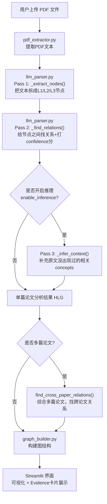

# HLG 工作流程图

根据 `pdf_extractor.py` / `llm_parser.py` / `graph_builder.py` 的实际代码逻辑整理。

## 每一步做什么（用今天单摆的例子对照）

| 步骤 | 输入 | 输出 | 今天观察到的问题 |
|---|---|---|---|
| PDF提取 | paper1.pdf | 纯文本 | 无问题，中文提取正常 |
| Pass1 提取节点 | 论文文本 | L1/L2/L3节点列表 | "假设条件"被迫塞进L2/L3，没有独立的"假设"类型 |
| Pass2 找关系 | 节点+原文 | 关系+confidence+explanation | 发现2处方向错误（causes反了、is-part-of反了），confidence仍打了9-10分 |
| Pass3 推理（可选） | 已有HLG | 额外的推测concepts | 今天没开启，后续可以试试看AI会联想出什么 |
| 跨论文关系 | 多篇HLG | 论文之间的关系 | 今天没细看，Day后续再核查 |
| 可视化 | 图结构 | 树状图+Evidence卡片 | 界面能正常展示 |
